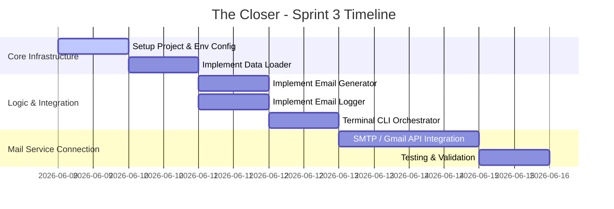

# Architecture & System Design: The Closer

This document outlines the architectural design and integration workflow for **"The Closer"** Cold Email Writer + Send Bot. It details the module responsibilities, security/auth strategies, data flow, and step-by-step implementation sequence.

---

## 1. System Architecture Overview

The system is designed using a **modular pipe-and-filter architecture** to keep logic separated, easily unit-testable, and safe to run in live settings.

```mermaid
flowboard
graph TD
    A[contacts.json / jobs.csv] -->|1. Load Records| B(Loader Module)
    B -->|Raw Contact Data| C(Generator Module)
    C -->|2. Template / LLM Personalization| D[Email Content: Subject & Body]
    D -->|3. Interactive Preview| E{User Confirmation CLI}
    
    E -->|Approved| F(Sender Module)
    E -->|Skipped / Cancelled| G(Logger Module)
    
    F -->|4. Create Draft / Send Email| H((Gmail API / SMTP))
    F -->|Result Status| G
    G -->|5. Audit Entry| I[outreach_log.csv]
```

---

## 2. Module Breakdown

### 1. Orchestrator (`main.py`)
- **Responsibility:** Coordinates the flow across all modules. It handles the interactive terminal UI loop where the user reviews each draft before sending.
- **Workflow Loop:**
  1. Load environment variables.
  2. Call the **Loader** to read the target list.
  3. For each target, call the **Generator** to produce an email subject and body.
  4. Print the generated email clearly in the terminal.
  5. Prompt the user: `[s]end, [d]raft, [k]ip, or [q]uit?`
  6. Call the **Sender** based on user selection.
  7. Call the **Logger** to record the transaction.

### 2. Data Loader (`data_loader.py`)
- **Responsibility:** Parses incoming job leads and contact files.
- **Formativity:** Supports fallback to a hardcoded list if files are missing, making live demonstrations robust. Supports JSON and CSV reading.

### 3. Email Generator (`email_generator.py`)
- **Responsibility:** Formats/writes the email body and subject line.
- **Modes:**
  - **Deterministic Mode:** Uses clean Python string templates with placeholder interpolation.
  - **LLM Mode (Stretch):** Connects to an LLM provider (e.g., Google Gemini, OpenAI, or Anthropic) to rewrite the draft dynamically based on the target company's description and recipient background.

### 4. Email Sender (`email_sender.py`)
- **Responsibility:** Handles network connections, protocol handshakes, and email creation.
- **Modes:**
  - **SMTP Mode:** Uses Python's native `smtplib` and `email.mime` modules. Authenticates via SSL/TLS on port `465` or STARTTLS on port `587`.
  - **Gmail API Mode (OAuth2):** Uses `google-api-python-client` to securely insert drafts or send emails via HTTP requests. Recommended for avoiding SMTP authentication blocks and creating drafts natively.
  - **Dry Run Mode:** Prints execution to console without making network requests. Controlled via `DRY_RUN=true` environment variable.

### 5. Auditor (`logger.py`)
- **Responsibility:** Appends record-keeping data to a persistent CSV database (`outreach_log.csv`).
- **Data Tracked:** Timestamp, Recipient Email, Company, Job Role, Subject, Delivery Action (Drafted/Sent/Skipped/Failed), and Error messages.

---

## 3. Connection & Integration Strategies (Auth Protocols)

Depending on your security constraints and demo requirements, choose one of the two following methods to connect to Gmail:

### Option A: SMTP Connection (Simpler Setup)
This is the fastest method to get running and requires no Google Developer Console configuration.

- **Requirements:**
  1. A Gmail account with **2-Step Verification** enabled.
  2. A generated **Google App Password** (under account security settings). *Do not use your main Google password.*
- **Protocol Details:**
  - Host: `smtp.gmail.com`
  - Port: `587` (STARTTLS) or `465` (SSL)
  - Python Libraries: `smtplib`, `email.mime.text.MIMEText`, `email.mime.multipart.MIMEMultipart`

### Option B: Gmail API via OAuth 2.0 (More Secure & Robust)
Highly recommended if the primary goal is creating **Gmail Drafts** rather than sending directly. This method is safer for job outreach because drafts let the user edit the message in the Gmail web interface before clicking send.

- **Requirements:**
  1. A project created in the [Google Cloud Console](https://console.cloud.google.com/).
  2. Enabled **Gmail API**.
  3. An OAuth 2.0 Client ID credential downloaded as `credentials.json`.
- **Protocol Details:**
  - Local authentication flow creates a persistent token file (`token.json`) upon first run.
  - Python Libraries: `google-auth-oauthlib`, `google-api-python-client`.
  - Endpoint: `service.users().drafts().create(userId="me", body=...)` or `service.users().messages().send(userId="me", body=...)`.

---

## 4. Proposed Folder Structure

```text
the-closer/
├── config/
│   └── settings.py          # Loads and validates environment variables
├── data/
│   └── contacts.json        # Target contacts list
├── docs/
│   ├── architecture.md      # System design
│   └── problem_statement.md # Project criteria
├── src/
│   ├── __init__.py
│   ├── data_loader.py       # Reads JSON/CSV
│   ├── email_generator.py   # Renders template / LLM prompt
│   ├── email_sender.py      # Connects SMTP / Gmail API
│   └── logger.py            # Appends to CSV
├── .env.example             # Template for environment configurations
├── .gitignore               # Ensures token.json, .env, and logs aren't committed
├── main.py                  # CLI Orchestrator
├── outreach_log.csv         # Audit log file (git-ignored)
└── requirements.txt         # Project dependencies
```

---

## 5. Implementation Roadmap



### Phase 1: Environment & Project Skeleton
1. Initialize the git repo.
2. Create `.gitignore` to prevent leaking credentials:
   ```text
   .env
   token.json
   outreach_log.csv
   __pycache__/
   ```
3. Set up `.env` and `settings.py`.

### Phase 2: Loader & Generator (Offline Workflow)
1. Build `data_loader.py` to read structured targets.
2. Build `email_generator.py` with custom greeting and hook insertions.
3. Verify formatting, word-count constraints (< 150 words), and tone.

### Phase 3: Interactive CLI UI & Logger
1. Implement the loop in `main.py`.
2. Format console outputs with clear borders and colors for review.
3. Integrate `logger.py` to ensure that even skipped records are recorded as `skipped`.

### Phase 4: Integration (The Handshake)
1. Choose either SMTP or Gmail API.
2. Build connection functions in `email_sender.py`.
3. Test with `DRY_RUN=true` first, then run a live test sending a draft to yourself.
